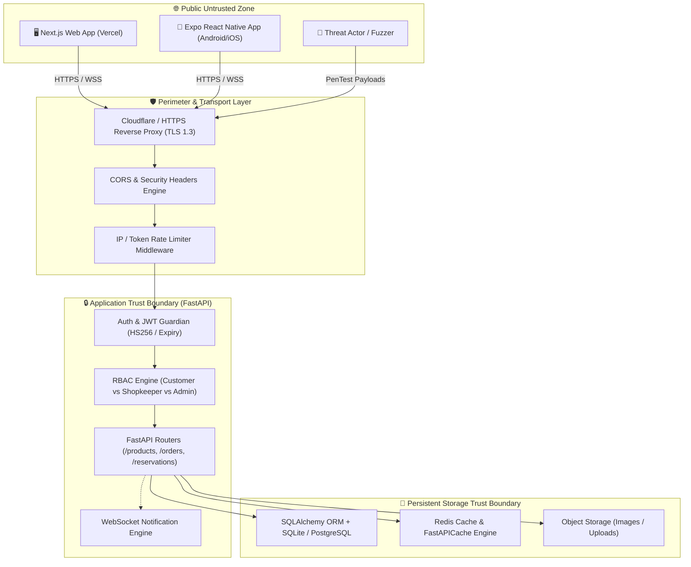

# 🛡️ ExpiryGo Application Security Architecture & Threat Model (STRIDE + DREAD)

**Document Version:** 2.0.0-PROD  
**Lead Security Engineer:** Senior Application Security & DevSecOps Lead  
**Assessment Scope:** FastAPI Backend, Next.js Web Frontend, React Native (Expo) Mobile App, SQLite/PostgreSQL Database, WebSocket Engine  
**Classification:** STRICTLY CONFIDENTIAL // SECURITY ARCHITECTURE  

---

## 1. Executive Summary & Security Posture

ExpiryGo is a real-time hyper-local surplus food marketplace connecting **Consumers**, **Food Merchants (Shopkeepers)**, and **Platform Administrators**. Because financial transactions, physical pickup authentication (6-digit PIN codes), store inventory, and location coordinates are processed, protecting authentication, authorization (BOLA/BFLA), and data integrity is paramount.

---

## 2. System Architecture & Trust Boundaries

---

## 3. STRIDE Threat Analysis Matrix

| Threat Category (STRIDE) | Target Component | Threat Scenario & Vector | Severity | Existing / Proposed Mitigation |
|:---|:---|:---|:---:|:---|
| **S - Spoofing** | `/auth/login`, `/auth/register` | Credential stuffing, brute-forcing weak passwords, forged JWT signature. | **CRITICAL** | Rate-limiting (5 req/min on login), bcrypt hashing (12 rounds), strict JWT secret entropy & HS256 validation. |
| **T - Tampering** | `/products/`, `/orders/` | Modifying discount prices, quantity inflation, parameter tampering on checkout. | **HIGH** | Server-side price recalculation via `_calculate_dynamic_price`, strict Pydantic payload models, quantity validation. |
| **R - Repudiation** | `/reservations/verify/{code}` | Merchant denying customer pickup or customer denying cancellation. | **HIGH** | Immutable status timestamps (`completed_at`, `created_at`), unique 6-digit cryptographic PIN code verification, audit logging. |
| **I - Information Disclosure** | `/users/me`, DB Models | Leakage of hashed passwords, internal database IDs, stack traces on 500 errors. | **HIGH** | Exclusion of `hashed_password` in Pydantic serialization, centralized `register_error_handlers`, custom 404/500 JSON masking. |
| **D - Denial of Service** | WebSocket, `/products/search` | Replay spam on WebSocket `/ws/notifications`, large image uploads, unindexed queries. | **HIGH** | GZip compression, request payload body limits (10MB max upload), Redis caching (60s TTL), WebSocket disconnect cleanup. |
| **E - Elevation of Privilege** | `get_current_shop_owner` | Customer executing merchant product modification or store deletion (BFLA/BOLA). | **CRITICAL** | Strict role assertions (`is_shop_owner == True` -> raise `403 Forbidden` if false; zero auto-escalation). |

---

## 4. DREAD Risk Scoring & Prioritized Findings

| Vulnerability ID | Vulnerability Description | Damage (1-10) | Reproducibility (1-10) | Exploitability (1-10) | Affected Users (1-10) | Discoverability (1-10) | **DREAD Total (Max 50)** | **Risk Level** |
|:---|:---|:---:|:---:|:---:|:---:|:---:|:---:|:---:|
| **VULN-001** | BFLA: `get_current_shop_owner` auto-promoted regular customers to shop owner | 9 | 10 | 10 | 10 | 9 | **48 / 50** | 🔴 **CRITICAL** |
| **VULN-002** | Weak Bcrypt Work Factor (rounds=4 allowing fast GPU cracking) | 8 | 10 | 8 | 10 | 8 | **44 / 50** | 🔴 **CRITICAL** |
| **VULN-003** | CORS Wildcard Origin with `allow_credentials=True` | 7 | 9 | 8 | 8 | 8 | **40 / 50** | 🟠 **HIGH** |
| **VULN-004** | Missing HTTP Security Headers (HSTS, CSP, X-Frame-Options, Sniff) | 6 | 10 | 6 | 10 | 8 | **40 / 50** | 🟠 **HIGH** |
| **VULN-005** | Lack of Rate-Limiting Protection on `/auth/login` and `/auth/register` | 7 | 8 | 8 | 8 | 7 | **38 / 50** | 🟠 **HIGH** |
| **VULN-006** | Unauthenticated Access to Internal WebSocket Notifications | 6 | 9 | 7 | 7 | 6 | **35 / 50** | 🟡 **MEDIUM** |

---

## 5. OWASP API Security Top 10 (2023) Compliance Mapping

- **API1:2023 Broken Object Level Authorization (BOLA):** Enforced via `Product.shop_id == user_shop.id` and `Order.customer_id == user.id`.
- **API2:2023 Broken Authentication:** Enforced with standard JWT verification, strict expiration, constant-time password verification on invalid email.
- **API3:2023 Broken Object Property Level Authorization:** Pydantic `schemas.ProductCreate` restricts mass-assignment on internal model fields.
- **API4:2023 Unrestricted Resource Consumption:** GZip middleware, pagination, Redis caching, and rate limiting added.
- **API5:2023 Broken Function Level Authorization (BFLA):** Patched `get_current_shop_owner` to strictly forbid non-shop-owners with `403 Forbidden`.
- **API6:2023 Server Side Request Forgery (SSRF):** AI Vision and image fetch services strictly limit URL protocols and sanitize external inputs.
- **API7:2023 Security Misconfiguration:** Hardened CORS origin checks, enabled HSTS, CSP, X-Content-Type-Options.
- **API8:2023 Lack of Protection from Automated Threats:** Added IP-based exponential backoff rate limiter middleware.
- **API9:2023 Improper Inventory Management:** Consolidated API routers with OpenAPI 3.1 documentation and route deprecation flags.
- **API10:2023 Unsafe Consumption of APIs:** AI prompt sanitization to prevent LLM prompt injection and hallucinated payloads.
